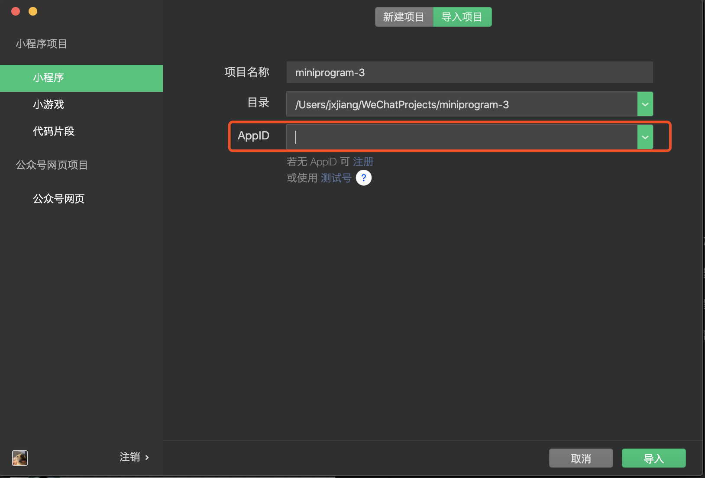
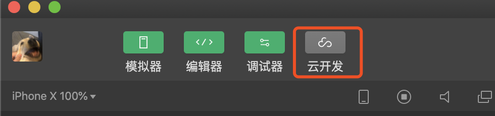
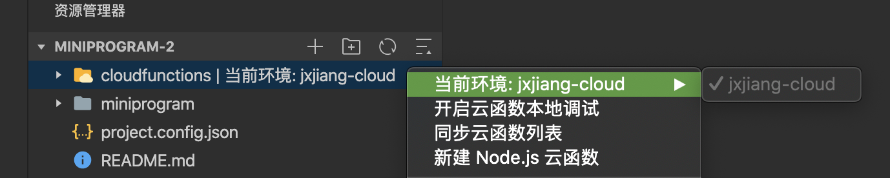

# wx_code
使用微信小程序实现简单的增删改查

## 环境准备及如何配置

1. 请先克隆项目到本地。
2. 下载[微信开发者工具](https://developers.weixin.qq.com/miniprogram/dev/devtools/download.html)。
3. 导入项目。
4. 申请属于自己的AppID并配置到项目中。

5. 开通微信云开发平台。

6. 选择到cloudfunctions文件夹，右键设置当前环境到上一步配置的云开发平台。

## 准备完毕
